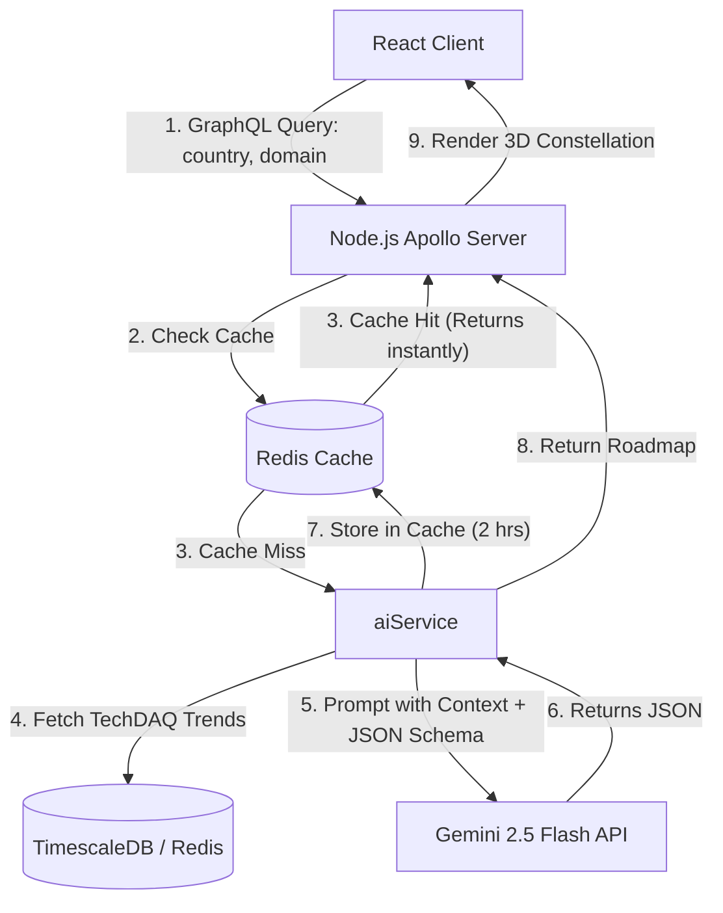

# Demo Presentation Script: TechDAQ AI Career Navigator

This document provides a step-by-step script and technical overview to guide you through recording a demo video for the **Live AI Career Navigator** and its interactive **3D Skill Roadmap**.

---

## Part 1: Video Recording Walkthrough Script

| Scene / Visual State | Actions to Perform | Spoken Script (What to Say) |
| :--- | :--- | :--- |
| **1. Intro: Market Terminal** | - Start on the landing page (`http://localhost:5173/`). - Show the main 3D force graph rotating. - Hover over a couple of green spheres. | *"Welcome! Today I will demonstrate the TechDAQ dashboard, a real-time monitor for tech industry trends. On this landing page—the Market Terminal—we see a live 3D universe of data posts harvested from online developers. We can spin this network to explore topics and click spheres to view content details."* |
| **2. Transitioning Tab** | - Move cursor to the navbar header. - Click **[ CAREER NAVIGATOR ]**. | *"Now, let's explore our new dedicated page, the **Career Navigator**. We separated this tool into its own view to provide a clean, spacious interface for AI-driven guidance and skills mapping."* |
| **3. Triggering AI** | - Select **United States** under Target Country. - Select **Backend Web** under Tech Domain. | *"By selecting our criteria, the frontend triggers an automated, real-time GraphQL query to our backend. The backend retrieves the latest local trends and queries Google's Gemini 2.5 Flash model to generate customized career insights on the fly."* |
| **4. Explaining AI Output** | - Read the "Primary Target" framework header. - Briefly show the description paragraph. | *"Under the recommendation card, the AI has analyzed the market and identified our primary technology stack—recommending Python, Django, and Rust—while highlighting current active demand for microservice architectures in the US."* |
| **5. Constellation Mapping** | - Move cursor to the **3D Roadmap Constellation**. - Left-click and drag to rotate the 3D skill tree. | *"Below the advice, we see a dynamic, interactive 3D skill roadmap constellation. It maps out a sequential learning path of four color-coded nodes. We can rotate this network in 3D to explore the curriculum hierarchy."* |
| **6. Interactive Nodes** | - Hover over **Cyan Node** (Step 1). - Hover over **Green Node** (Step 2). - Hover over **Purple Node** (Step 3). - Hover over **Red Node** (Step 4). | *"As I hover over each node, the console details card updates instantly. We begin at the bottom with **Cyan (Fundamental concepts)**, progress to **Green (Core frameworks like Django)**, climb to **Advanced tools in Purple (databases and security)**, and finish with **Red (Market-specific skills)**."* |

---

## Part 2: Technical Architecture (How it works in the Backend)

If you are asked about the technical implementation, here is the architectural flow of how the career path recommendations are handled:

### 1. GraphQL Gateway
The client queries the backend via Apollo Client using a parameterized query:
`aiRecommendation(country: $country, domain: $domain) { framework details roadmap { name type description } }`

### 2. Redis Caching Layer (Quota Protection)
Because the Gemini Free Tier is limited to **20 requests per day**, the backend implements a **Redis Caching layer**. 
- Before hitting the LLM API, the backend checks if the key `ai:recommendation:${country}:${domain}` exists.
- If it exists, it returns it under **5 milliseconds** and consumes **0 API quota**.
- Successful API responses are cached in Redis for **2 hours**.

### 3. Context-Aware Prompting (Gemini 2.5 Flash)
If a cache miss occurs, the backend:
- Queries the latest **live trending keywords** from Redis/TimescaleDB to feed into the prompt.
- Calls Gemini 2.5 Flash via standard HTTP POST, passing a strict **JSON response schema** (`responseSchema`). This guarantees that the LLM returns a JSON object containing `framework`, `details`, and a `roadmap` array with exact properties (`name`, `type`, `description`), preventing any formatting errors.

### 4. Resilient Static Fallbacks
If Gemini API encounters a quota block (429) or network issue, the backend catches the error, logs it, and returns a pre-defined static curriculum structure so that the front-end layout remains functional.
