# Software Project Documentation Package
## InptPulse / TechBuzz v2 — Event-Driven Telemetry & Career Navigator

---

## 1. Executive Summary

### 1.1 Project Overview
**InptPulse / TechBuzz v2** is a real-time technology trend analytics and developer career mapping platform. The system continuously ingests software engineering data feeds (e.g., Reddit posts, technology forums), routes them through a high-throughput **Event-Driven Processing Pipeline**, filters them for technical relevance, processes them through deep-learning Natural Language Processing (NLP) models, and saves the outputs in a hybrid database infrastructure. 

The analytical results are served via a unified **Apollo GraphQL API Gateway** and visualized on a premium, dark-mode cyberpunk React dashboard containing interactive 3D network graphs, metrics radar charts, geographic maps, and predictive trend lines.

### 1.2 Problem Statement
In **Version 1 (V1)**, the pipeline relied on a monolithic architecture coordinated by BullMQ. This approach introduced significant limitations:
1. **Tight Coupling & Latency bottlenecks**: High-overhead spawns of Python subprocesses for every single post ran synchronously inside the Node queue thread.
2. **CPU Exhaustion**: Running zero-shot text classification models (DeBERTa) on every single text payload caused CPU starvation on the host server.
3. **Database Redundancy**: Document duplication in MongoDB arose due to a lack of atomic upsert operations on natural keys.
4. **Tight Serialization**: Binary embeddings were serialized as massive Base64 strings across all internal broker buffers, consuming memory and network bandwidth.

**Version 2 (V2)** resolves these challenges by migrating to an event-driven paradigm built on **Redis Streams** with isolated, decoupled multi-stage worker groups, implementing rule-based fast-path classification, enforcing natural-key idempotent database operations, and utilizing raw float array storage for binary embeddings.

### 1.3 Objectives
- **Ingestion Throughput**: Ingest and process social payloads at a rate of >100 entries per second.
- **Classification Accuracy**: Classify posts into specific technology sectors with >85% confidence.
- **Sub-50ms API Latency**: Serve historical graphs, radar metrics, and telemetry projections under 50 milliseconds.
- **Predictive Analytics**: Deliver 7-day future demand projections for technology trends using LSTM recurrent neural networks.
- **Premium User Experience**: Provide developers with a fluid, dark-mode terminal layout featuring interactive 3D graphs, geographic distribution metrics, and career roadmap generation.

### 1.4 Target Users
- **Software Engineers & Job Seekers**: To discover trending stacks, local market salary baselines, and structured learning roadmaps.
- **Tech Lead & System Architects**: To track technology adoption rates and momentum across major frameworks.
- **DevOps Engineers**: To monitor system performance, ingestion queues, classification latencies, and container metrics.
- **Project Stakeholders**: To analyze technical signal strength across regions (e.g., USA, France, Morocco).

### 1.5 Expected Business Value
- **Developer Productivity**: Cuts research times down by serving pre-filtered, regional tech stack roadmaps.
- **Automated Intelligence**: Eliminates manual content categorization by utilizing automated NLP classification.
- **Market Forecasting**: Gives organizations early indications of framework momentum shifts to steer engineering hires.

---

## 2. Functional Analysis

### 2.1 Detailed Feature Descriptions
1. **Market Terminal Dashboard**: Renders overall system counters (Total Datagrams, Active Nodes), interactive lists of Top Market Movers (categories sorted by volume and momentum), and global filters for Target Country and Technology Domain.
2. **3D Universe Graph**: Renders a 3D canvas featuring active categories as large hub nodes, with individual posts (data packets) orbiting them as small spheres. Nodes are colored dynamically by sentiment (positive is green, negative/neutral is red). Clicking a post node displays details in a drawer overlay; clicking a category hub shifts the camera focus to that sector.
3. **Post Details Drawer**: An overlay card showing the post title, primary category, content preview, and a visual sentiment confidence indicator. It floats on top of all widgets at `z-index: 100`.
4. **Career Navigator**: Provides localized tech stack guides and roadmap projections mapped to major domains (Frontend, Backend, AI, Database, DevOps, Security, Data Engineering, IoT). Features learning milestones: Fundamentals, Core, Advanced, and Market Fit.
5. **Telemetry Grid**: Offers high-density widgets including 7-day Demand Forecasting, Projection Insights, and Signal Strength metrics, with keyword selection tabs featuring thin border borders and indicator status lights.

### 2.2 Functional Requirements
- **FR-1 (Ingestion Filter)**: The system must automatically discard non-IT related posts using rule-based indicator matching before hitting deep learning nodes.
- **FR-2 (NLP Enrichment)**: The pipeline must extract up to 5 keyphrases (using KeyBERT), compute a 384-dimension vector embedding (using Sentence-Transformers), and assign a primary category with its zero-shot confidence score (using DeBERTa).
- **FR-3 (Interactive 3D Graph)**: Clicking a post sphere in the 3D graph must update the global application state and open the post details drawer.
- **FR-4 (Forecast Queries)**: The server must generate a 7-day future trend forecast using an LSTM model trained on the last 14 days of historical mention counts.
- **FR-5 (AI Roadmaps)**: The system must fetch structured career recommendations from Gemini API, falling back to dynamic trend-aware mock templates if the API quota is throttled.

### 2.3 Non-Functional Requirements
- **NFR-1 (Performance)**: The UI must load the 3D Force Graph under 2.0 seconds. Apollo GraphQL query response times must be <50ms for cached objects and <500ms for fresh database aggregations.
- **NFR-2 (Scalability)**: Background workers must run as isolated processes capable of horizontal scaling using Redis Consumer Groups.
- **NFR-3 (Reliability & Idempotency)**: Ingestion tasks must survive service crashes. The persist worker must use MongoDB atomic upserts (`EnrichedPost.updateOne` on natural keys) to ensure duplicate events do not double-write database records.
- **NFR-4 (Security)**: Production Apollo middleware must check JWT authorization headers for mutation/query controls.

---

## 3. System Architecture

### 3.1 Component Topology

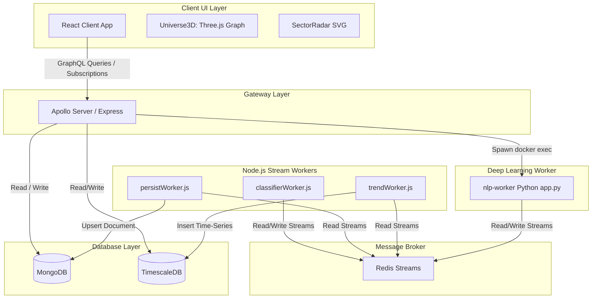

### 3.2 Communication Protocols
- **GraphQL over HTTP**: Client communicates with the Apollo Server gateway on port 3001 using standard POST payloads for queries and mutations.
- **GraphQL over WebSockets (WS)**: Live trend updates are pushed in real-time from the backend to the client via WebSockets (`graphql-ws` protocol).
- **Redis Streams (RESP)**: Workers consume and publish event messages in real-time over TCP connections using standard Redis protocol.
- **Docker Exec (STDIN/STDOUT)**: The Apollo Server calls Python-based LSTM forecasting scripts dynamically inside the running Python Docker container using interactive standard input streams, bypassing HTTP interface layers to optimize response times.

### 3.3 Technology Stack Justification
- **React.js & Vite**: Fast Hot Module Replacement (HMR) for responsive interfaces, paired with React Three Fiber/react-force-graph-3d for hardware-accelerated rendering.
- **Apollo GraphQL**: Unified type schema, flexible queries to minimize bandwidth, and built-in subscription support.
- **Redis Streams**: High-performance, memory-backed message broker supporting consumer groups, message acknowledgement (ACK), and persistent offsets.
- **MongoDB**: Schema-flexible document store ideal for unstructured post contents, nested keywords list, and metadata categories.
- **TimescaleDB (PostgreSQL)**: Optimized SQL engine with hypertable support for high-write-volume time-series trend analysis (velocity, acceleration, and counts).
- **PyTorch & HuggingFace (DeBERTa / keyphrase-extraction)**: Industry-standard NLP pipeline. DeBERTa-v3 is selected for zero-shot text classification, while all-MiniLM-L6-v2 produces dense 384-dimension vector embeddings.

---

## 4. UML Diagrams

### 4.1 Use Case Diagram

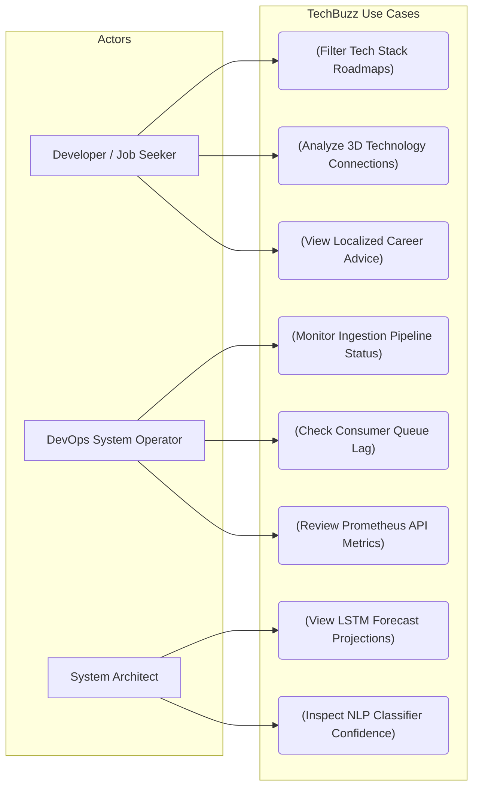

### 4.2 Class Diagram

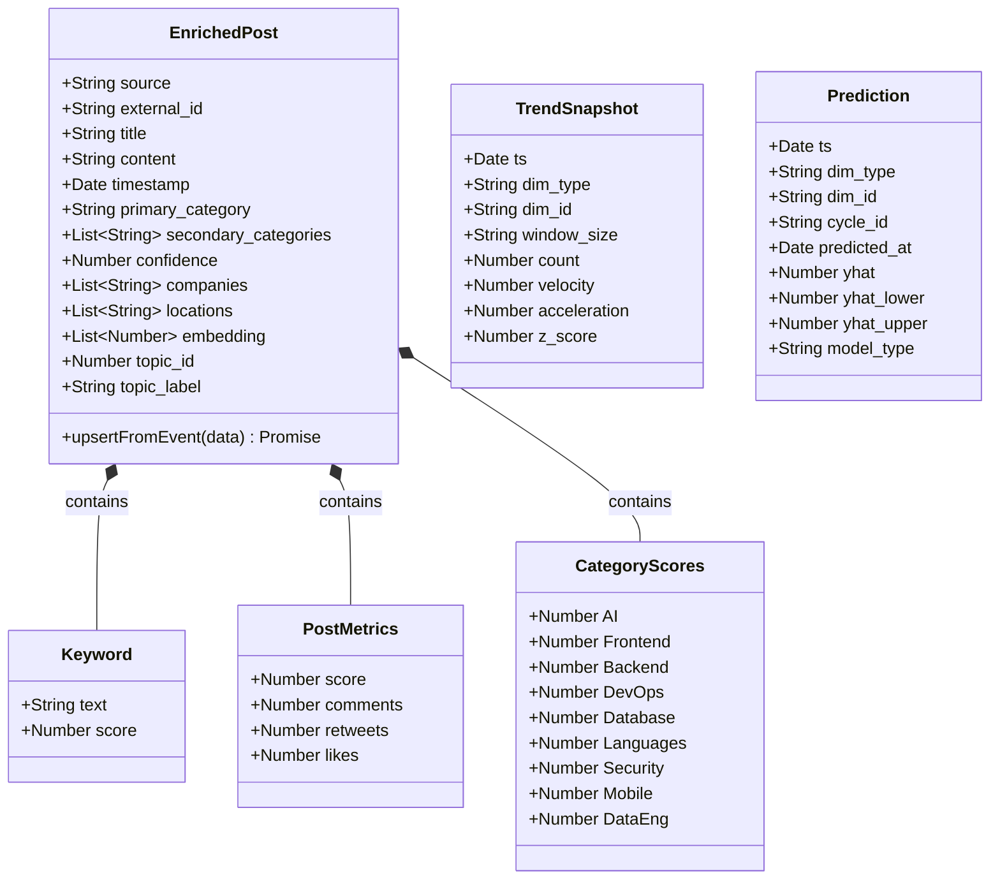

### 4.3 Sequence Diagram: Data Ingestion & NLP Enrichment Pipeline

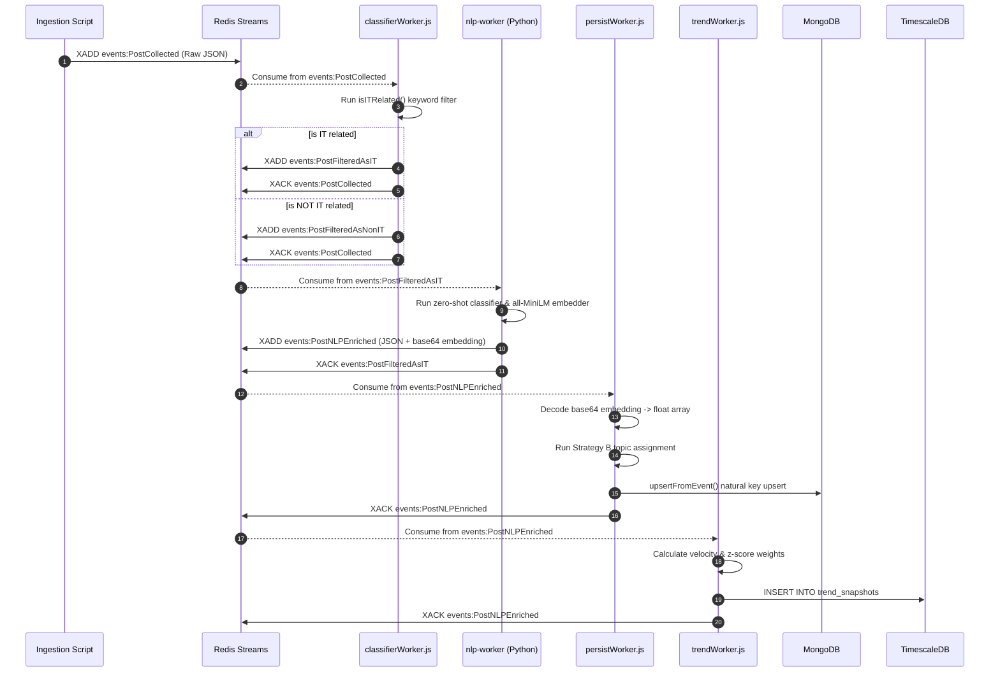

### 4.4 Sequence Diagram: LSTM Trend Prediction Query Flow

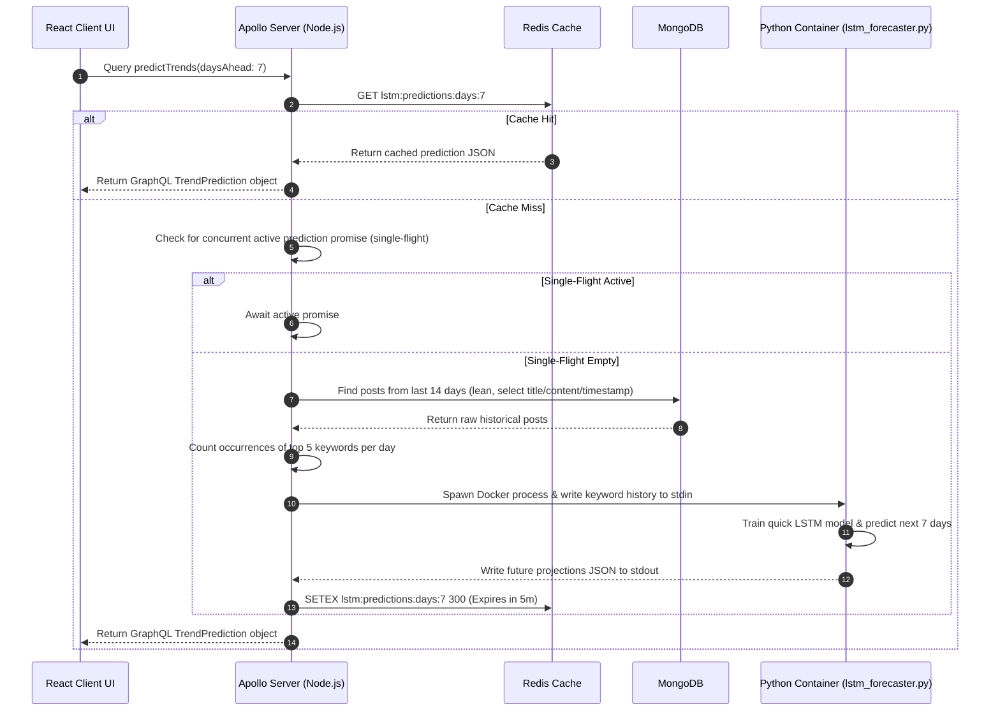

### 4.5 Activity Diagram: Ingested Post Processing

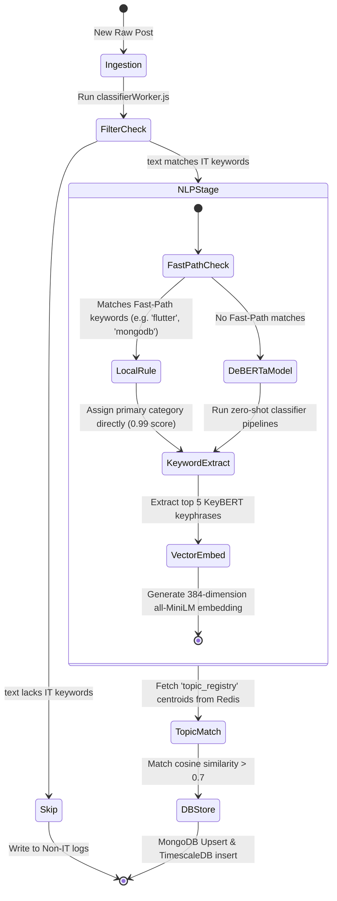

### 4.6 Component Diagram

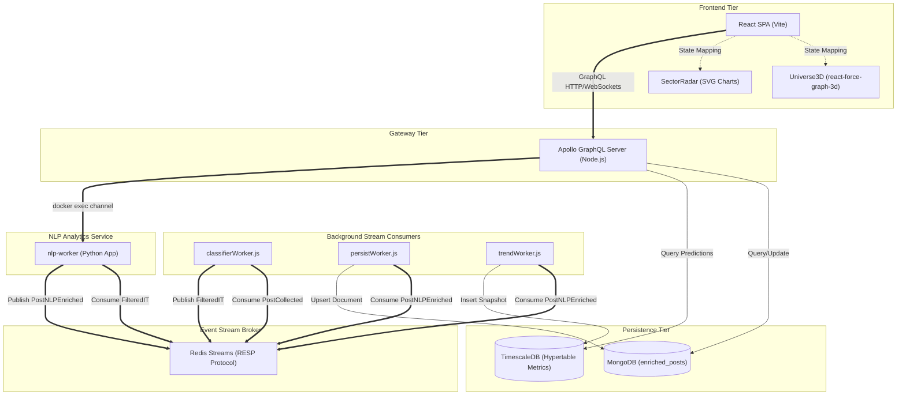

### 4.7 Deployment Diagram

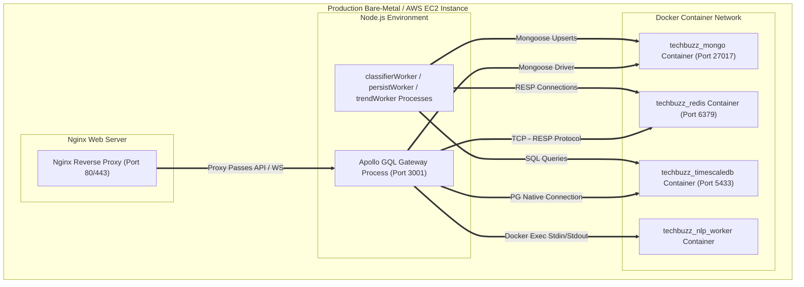

### 4.8 Package Diagram

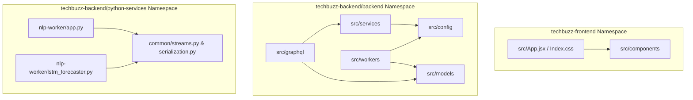

---

## 5. Database Design

### 5.1 ERD (Entity Relationship Diagram)

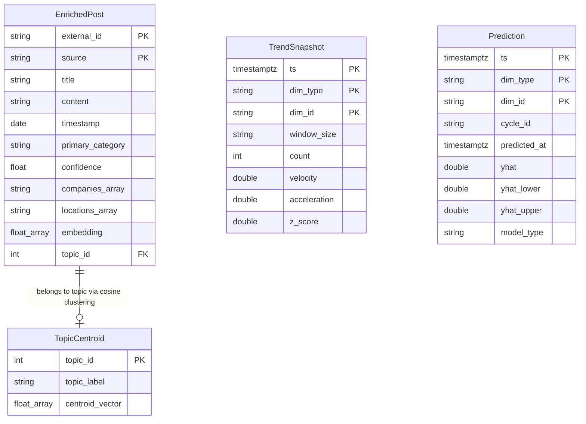

### 5.2 MongoDB Collections Schema & Index Details

#### 5.2.1 Collection: `enriched_posts`
Stores social posts enriched with NLP categories, extracted entities, sentiment metrics, and model vector offsets.

| Field | Type | Description | Constraints |
|---|---|---|---|
| `_id` | ObjectId | MongoDB unique index identifier | Auto-generated |
| `source` | String | Data source index ('reddit', 'twitter') | Indexed, Required |
| `external_id` | String | Native identifier inside raw source payload | Required |
| `title` | String | Plain-text title of the feed document | Default: '' |
| `content` | String | Post body text content | Default: '' |
| `author` | String | Username of original creator | Default: '' |
| `timestamp` | Date | Creation date of original post | Descending Index, Required |
| `keywords` | Array (Object) | Keyphrase structures containing `text` (String) and `score` (Number) | Indexed |
| `primary_category` | String | Category label assigned by zero-shot classifier | Indexed, Required |
| `secondary_categories` | Array (String)| Auxiliary categories matching zero-shot threshold | Default: `[]` |
| `category_scores` | Object | Full classification scoring map | Default: `0.0` values |
| `confidence` | Number | Prediction score of primary category (0.0 to 1.0) | Indexed, Required |
| `companies` | Array (String) | Technical companies mentioned in text | Indexed, Default: `[]` |
| `locations` | Array (String) | Geographic regions matching location list | Indexed, Default: `[]` |
| `embedding` | Array (Number) | Dense 384-dimensional vector float array | Default: `[]` |
| `topic_id` | Number | Target topic cluster index matching vector similarity | Nullable, Indexed |
| `topic_label` | String | Dynamic cluster label describing topic theme | Nullable |
| `topic_match_score` | Number | Cosine similarity value of post to topic centroid | Nullable |

*Index Optimizations:*
1. `idx_external_source_unique` (Unique index): `{ external_id: 1, source: 1 }` - Ensures idempotency during worker upsert calls.
2. `idx_category_timestamp`: `{ primary_category: 1, timestamp: -1 }` - Optimizes chronological list requests.
3. `idx_keywords_text`: `{ 'keywords.text': 1 }` - Facilitates keyword search matches.

---

### 5.3 TimescaleDB Relational Table Schemas

#### 5.3.1 Table: `trend_snapshots`
Time-series table tracking count densities, speed velocity, and z-scores.

| Column | SQL Type | Modifiers | Description |
|---|---|---|---|
| `ts` | TIMESTAMPTZ | NOT NULL, Primary Key (Time) | Log timestamp |
| `dim_type` | TEXT | NOT NULL | Category filter ('category', 'topic', 'keyword') |
| `dim_id` | TEXT | NOT NULL | Sector name (e.g. 'AI', 'topic_47', 'rust async') |
| `window_size` | TEXT | NOT NULL | Size interval ('1h', '6h', '24h') |
| `count` | INTEGER | | Mentions frequency count inside time segment |
| `velocity` | DOUBLE PRECISION | | Trend growth rate |
| `acceleration` | DOUBLE PRECISION | | Rate of velocity change |
| `z_score` | DOUBLE PRECISION | | Standard deviation variance offset |

*Optimizations:*
- **Hypertable**: Partitioned by time axis (`ts`) to optimize read-write speeds over growing records.
- **Index**: `CREATE INDEX ON trend_snapshots (dim_type, dim_id, ts DESC);`

#### 5.3.2 Table: `predictions`
Time-series projections calculated by the LSTM forecasting nodes.

| Column | SQL Type | Modifiers | Description |
|---|---|---|---|
| `ts` | TIMESTAMPTZ | NOT NULL, Primary Key | Targeted future date |
| `dim_type` | TEXT | NOT NULL | Dimension type selector |
| `dim_id` | TEXT | NOT NULL | Dimension value selector |
| `cycle_id` | TEXT | NOT NULL | Target batch identifier |
| `predicted_at`| TIMESTAMPTZ | NOT NULL | Model generation timestamp |
| `yhat` | DOUBLE PRECISION | | Projected trend value |
| `yhat_lower` | DOUBLE PRECISION | | Lower confidence bound projection |
| `yhat_upper` | DOUBLE PRECISION | | Upper confidence bound projection |
| `model_type` | TEXT | | Underlying algorithm label ('lstm') |

---

## 6. Component Breakdown

### 6.1 Backend Workers & Services

#### 6.1.1 `classifierWorker.js`
- **Purpose**: Low-overhead rule-based pre-filter layer.
- **Responsibilities**: Subscribes to raw input stream `events:PostCollected`. Discards general/spam entries, routing only software engineering related documents to further pipelines.
- **Inputs**: Raw event objects containing text, author, and timestamp.
- **Outputs**: Publishes `PostFilteredAsIT` to stream `events:PostFilteredAsIT` or logs `PostFilteredAsNonIT` to `events:PostFilteredNonIT`.
- **Dependencies**: Redis TCP connection client.

#### 6.1.2 `nlp-worker` (`python-services/nlp-worker/app.py`)
- **Purpose**: Deep learning semantic analysis pipeline.
- **Responsibilities**:
  1. Consumes filtered inputs from Redis Stream `events:PostFilteredAsIT`.
  2. Runs fast-path classification to optimize performance: matches explicit keywords (e.g. 'flutter', 'react', 'kubernetes') to bypass heavy neural network overhead.
  3. Spawns zero-shot classifiers (DeBERTa-v3) and Keyphrase extractors (KeyBERT) for non-fast-path items.
  4. Generates dense text vectors (all-MiniLM-L6-v2) for topic clustering.
- **Inputs**: Cleaned IT post documents.
- **Outputs**: Serializes float embeddings as Base64 and publishes `PostEnriched` payload to `events:PostNLPEnriched`.
- **Dependencies**: PyTorch, sentence-transformers, transformers pipeline.

#### 6.1.3 `persistWorker.js`
- **Purpose**: MongoDB persistence layer.
- **Responsibilities**:
  1. Consumes from Redis Stream `events:PostNLPEnriched`.
  2. Pulls target centroids vector register `topic_registry` from Redis.
  3. Decodes Base64 embeddings back to float vectors, computing cosine similarities against topic centroids to dynamically tag clustering labels (similarity threshold >0.7).
  4. Calls atomic database upserts to save records.
- **Inputs**: Enriched JSON strings with Base64 embedding strings.
- **Outputs**: Inserts/Updates database collection `enriched_posts`.

#### 6.1.4 `trendWorker.js`
- **Purpose**: Time-series analytics compiler.
- **Responsibilities**: Listens for NLP enriched outputs and logs snapshots (velocity, acceleration) to TimescaleDB relational database.
- **Inputs**: Enriched post document.
- **Outputs**: SQL records in `trend_snapshots` tables.

#### 6.1.5 `lstm_forecaster.py`
- **Purpose**: Autoregressive neural network projection tool.
- **Responsibilities**:
  1. Receives daily counts of target keywords from standard input stream.
  2. Synthesizes missing sequences (if history <30 days) utilizing normal distributions and weekly cycle weightings.
  3. Trains a quick PyTorch recurrent neural network (TechTrendLSTM) with a sliding window of 7 days to forecast counts for the next 7 days.
- **Inputs**: STDIN JSON containing keyword array counts.
- **Outputs**: STDOUT JSON containing forecast arrays and model confidence metrics.

---

### 6.2 Frontend UI Components

#### 6.2.1 `Universe3D.jsx`
- **Purpose**: Renders technology categories and posts as an interactive 3D solar system.
- **Responsibilities**: Maps node relationships (categories as hubs, posts as orbiting packets) using Canvas elements. Triggers camera animations on category select and state updates on node click.
- **Inputs**: Array of `posts` and `onNodeClick` handler.
- **Outputs**: Canvas node interactions and camera movement paths.

#### 6.2.2 `UseCaseExplorer.jsx` (Career Navigator)
- **Purpose**: Renders regional tech stack roadmaps.
- **Responsibilities**: Provides selectors for Country/Domain, retrieves recommendations via GraphQL queries (`aiRecommendation`), and renders learning roadmaps (Fundamentals -> Core -> Advanced -> Market).
- **Inputs**: State parameters `selectedCountry`, `selectedDomain`.

#### 6.2.3 `GlobalTelemetryMap.jsx` (Telemetry Grid)
- **Purpose**: Renders projection and analysis grids.
- **Responsibilities**: Renders demand selector lists, signal projections, and forecasting timelines. Integrates status indicator lights and white border active states.
- **Inputs**: `posts` and `trends` datasets.

---

## 7. API Documentation

The gateway exposes query and subscription endpoints using Apollo Server GraphQL.

### 7.1 Schema Definitions & Queries

#### 7.1.1 Query: `predictTrends`
Calculates PyTorch LSTM forecast projections for the top trending keywords.

- **Request Arguments**:
  * `daysAhead` (Int): Default is 7.
- **Response Format**:
  ```graphql
  type DailyForecast {
    date: String
    count: Float
  }

  type TrendPrediction {
    keyword: String
    historical: [DailyForecast]
    forecast: [DailyForecast]
    confidenceScore: Float
  }
  ```

- **Query Example**:
  ```graphql
  query GetLSTMForecast($days: Int) {
    predictTrends(daysAhead: $days) {
      keyword
      confidenceScore
      forecast {
        date
        count
      }
      historical {
        date
        count
      }
    }
  }
  ```

- **JSON Response Payload**:
  ```json
  {
    "data": {
      "predictTrends": [
        {
          "keyword": "kubernetes",
          "confidenceScore": 89.4,
          "forecast": [
            { "date": "2026-06-10", "count": 14.5 },
            { "date": "2026-06-11", "count": 16.2 }
          ],
          "historical": [
            { "date": "2026-06-08", "count": 13.0 },
            { "date": "2026-06-09", "count": 12.0 }
          ]
        }
      ]
    }
  }
  ```

---

#### 7.1.2 Query: `aiRecommendation`
Returns regional stack details and structured career roadmap milestones.

- **Request Arguments**:
  * `country` (String!): target region (e.g. 'USA', 'France', 'Morocco', 'All')
  * `domain` (String!): target tech category (e.g. 'Frontend', 'Backend', 'AI', 'DevOps')

- **Query Example**:
  ```graphql
  query GetCareerGuide($country: String!, $domain: String!) {
    aiRecommendation(country: $country, domain: $domain) {
      framework
      details
      roadmap {
        name
        type
        description
      }
    }
  }
  ```

- **JSON Response Payload**:
  ```json
  {
    "data": {
      "aiRecommendation": {
        "framework": "Next.js & React",
        "details": "Production structures in USA utilize React and Next.js extensively for Frontend modules. Developer structures prioritize modular UI components and server-side rendering setups.",
        "roadmap": [
          {
            "name": "Fundamentals",
            "type": "fundamental",
            "description": "Master HTML, modern CSS, and Javascript basics."
          },
          {
            "name": "React Hooks",
            "type": "core",
            "description": "Understand hooks, state management, and props."
          }
        ]
      }
    }
  }
  ```

---

### 7.2 GraphQL Subscriptions

#### 7.2.1 Subscription: `trendsUpdated`
Pushes live trend updates to the UI whenever new posts are processed.

- **Subscription Query**:
  ```graphql
  subscription OnTrendsUpdate {
    trendsUpdated {
      keyword
      count
      momentum
      avgSentiment
    }
  }
  ```

---

### 7.3 Security (JWT Authentication Scheme)
Production instances check GraphQL query requests using standard JWT validation rules:
- **Authorization Header Format**: `Authorization: Bearer <jwt-token>`
- **Token Fields**: `userId`, `role` ('user', 'admin'), and `expirationTime`.
- **Enforcement**: Public queries (`currentTrends`, `aiRecommendation`) are open. Administrative utilities (triggering manual database updates or running LSTM rebuilds) require `admin` authorization scopes.

---

### 7.4 Error Handling Strategy
The API intercepts query exceptions using Apollo Server error filters:
- **Database Connection Drop**: Logs detailed stack traces internally, returning a safe gateway error code to the client: `INTERNAL_SERVER_ERROR`.
- **ML Exec Failures**: If the Python LSTM executor crashes or standard streams output invalid formats, the gateway falls back gracefully, utilizing a regression trend model to output predictions without crashing the client page.
- **Client Argument Issues**: Throws standard validation errors: `BAD_USER_INPUT`.

---

## 8. Detailed Workflow Analysis

### 8.1 Data Processing Lifecycle

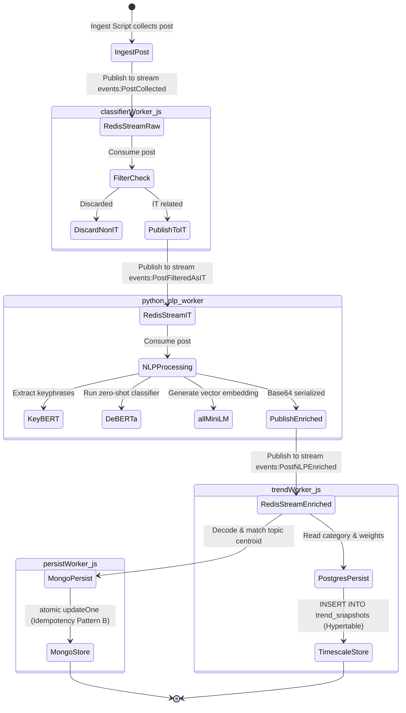

### 8.2 User Interaction Workflows

#### 8.2.1 Scenario: User Views Post Details in 3D Graph
1. User clicks the **Market Terminal** tab.
2. The UI queries GraphQL for the list of enriched posts and trends, initializing the 3D Canvas.
3. User hovers over a post sphere (data packet) to see its title, then clicks it.
4. The canvas triggers the `onNodeClick` callback, passing the post's metadata object.
5. React updates the `selectedPost` state variable.
6. The UI renders the **Post Details Drawer** at the top right (`z-index: 100`) containing the post's title, confidence, and primary category.

#### 8.2.2 Scenario: User Generates Career Roadmap
1. User clicks the **Career Navigator** tab.
2. User selects a target Country (e.g., "Morocco") and a Technology Domain (e.g., "Frontend").
3. React triggers the `useQuery(GET_AI_RECOMMENDATION)` Hook.
4. The Apollo gateway checks Redis Cache.
   - **Cache Hit**: Returns the recommendation JSON immediately.
   - **Cache Miss**: Calls the Gemini API using the prompt context, caches the output in Redis for 2 hours, and returns it to the client.
5. The UI renders the learning milestones in a vertical roadmap list.

---

## 9. Scalability, Performance & Caching

### 9.1 Caching Strategy
- **AI Recommendation Cache**: Gemini API calls are cached in Redis (`ai:recommendation:<country>:<domain>`) with a **2-hour Time-to-Live (TTL)**. This avoids API rate limits and reduces hosting costs.
- **LSTM Projections Cache**: LSTM forecasts are cached in Redis (`lstm:predictions:days:<daysAhead>`) with a **5-minute TTL**. Since LSTM execution is resource-intensive (spawning Python instances), caching is critical to keep the system responsive.

### 9.2 Cache Stampede Prevention (Single-Flight Pattern)
To prevent multiple concurrent queries from triggering duplicate Python processes (Cache Stampede), the gateway implements a **Single-Flight consolidation pattern** inside `predictTrends`:

```javascript
// A single global promise handles active prediction calculations
let activePredictTrendsPromise = null;

async function resolver(daysAhead) {
  if (activePredictTrendsPromise) {
    // Join the existing active run instead of starting a new process
    return activePredictTrendsPromise;
  }
  
  activePredictTrendsPromise = (async () => {
     // Run Mongo aggregates, spawn Python LSTM, write to Redis...
  })();
  return activePredictTrendsPromise;
}
```

### 9.3 Database Index Optimizations
- **MongoDB Compound Indexing**: We index `{ primary_category: 1, timestamp: -1 }`. This allows Apollo to fetch sorted post histories by category directly from memory index structures.
- **TimescaleDB Hypertables**: By converting `trend_snapshots` and `predictions` tables into TimescaleDB hypertables, the database automatically partitions data by time segments. This keeps insertion and query times constant even as the dataset grows to millions of records.

---

## 10. Future Roadmap & Technical Debt

### 10.1 Technical Debt Considerations
- **Sync Python Execution**: The Apollo Server gateway currently spawns Python instances using `docker exec` STDIN/STDOUT channels. While simple, this approach introduces overhead when handling highly concurrent traffic.
- **In-Memory Redis Registers**: The `topic_registry` object is currently stored as a single flat string in Redis. As the number of topics grows, querying it will become less efficient.

### 10.2 Future Improvements
- **NLP HTTP Daemon**: Transition the Python worker from standard stream triggers to a dedicated, high-performance REST/gRPC microservice running FastAPI.
- **Vector Database Integration**: Replace raw float calculations in Node memory with a dedicated vector database (e.g., Milvus, Qdrant, or PGVector) to support real-time semantic similarity searches across millions of posts.
- **Distributed Caching**: Migrate Redis caches to a high-availability clustered Redis setup with partition replication.
