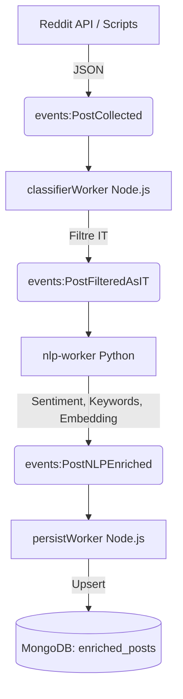

# TechBuzz Backend - Sprint 1: Event-Driven Architecture (V2)

Bienvenue dans le dépôt du Sprint 1 du projet **InptPulse / TechBuzz v2**. Ce sprint marque une refonte architecturale majeure, passant d'un pipeline monolithique (V1) basé sur BullMQ à une architecture 100% **Event-Driven (Niveau 3)** propulsée par **Redis Streams**.

## 🚀 Objectif du Sprint 1

L'objectif principal était de stabiliser, corriger et rendre opérationnel le pipeline d'ingestion et de traitement NLP de bout en bout en résolvant les goulets d'étranglement de la V1 (lenteurs de traitement, crashs du worker Python, redondance dans MongoDB).

### Ce qui a été accompli :
1. **Migration vers Redis Streams :** Remplacement complet de BullMQ par Redis Streams pour le passage de messages entre les différents workers de manière asynchrone et découplée.
2. **Backfill Reddit Automatisé :** Mise en place d'un script (`backfill-reddit.js`) permettant de récupérer l'historique massif des subreddits tech et de les injecter dans la ram (`events:PostCollected`).
3. **Filtre IT (Node.js) :** Création du `classifierWorker.js` qui consomme les posts bruts, filtre ceux pertinents pour la tech/IT, et publie les résultats vers `events:PostFilteredAsIT`.
4. **Worker NLP (Python) Robuste :** 
   - Résolution des problèmes de décodage (`bytes` vs `string`) depuis Redis.
   - Parsing correct des enveloppes d'événements.
   - Chargement des modèles IA lourds (DeBERTa pour le Zero-Shot Classification, Sentence-Transformers pour l'embedding).
   - Publication des posts enrichis (catégories, mots-clés, sentiment) vers `events:PostNLPEnriched`.
5. **Worker de Persistance (Node.js) :** Création du `persistWorker.js` qui écoute les événements finaux enrichis et les sauvegarde efficacement dans MongoDB via des opérations d'upsert.

## 🏗️ Architecture V2

Le système fonctionne désormais avec 8 couches découplées. Voici le flux de la donnée :



## 🛠️ Stack Technique
- **Backend / Workers :** Node.js, Express, Apollo GraphQL
- **NLP Processing :** Python 3.10, PyTorch, HuggingFace (`sentence-transformers`, `DeBERTa`)
- **Message Broker :** Redis Streams (avec Consumer Groups & Idempotency)
- **Base de données :** MongoDB (Stockage final)
- **Monitoring :** Prometheus & Grafana
- **Déploiement :** Docker & Docker Compose

## 🏃‍♂️ Comment lancer le projet

1. Démarrer l'infrastructure Docker (Redis, MongoDB, Python NLP Worker) :
   ```bash
   docker compose up -d --build
   ```

2. Installer les dépendances Node.js :
   ```bash
   cd backend
   npm install
   ```

3. Lancer l'API et les Workers Node.js (dans un autre terminal) :
   ```bash
   cd backend
   node src/app.js
   ```

4. Lancer le script de récupération initiale (Backfill) :
   ```bash
   cd backend
   node scripts/backfill-reddit.js
   ```

## 🔍 Validation
Une fois le backfill lancé, vous pouvez suivre les logs du conteneur Python pour voir l'IA enrichir les posts en temps réel :
```bash
docker compose logs -f nlp-worker
```
Les données finales seront visibles dans MongoDB (collection `techbuzz.enriched_posts`).
